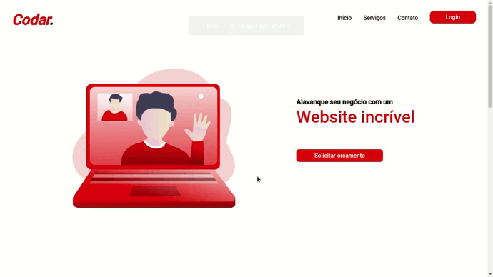
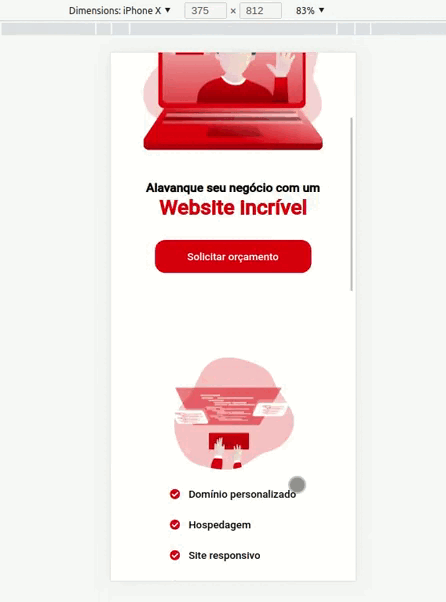

<h1 align='center'>Desafio Codar</h1>

Um desafio da plataforma <a href="https://www.devchallenge.com.br/challenges?type=frontend">DevChallenge</a>, para criar um site responsivo.

## Sobre

O intuito do desafio é construir um website responsivo e parecido ao máximo com o design proposto. A estratégia usada foi a construção através do método mobile first, também foi criado classes de: alinhamento, logo e botão. Assim foi possivel criar uma forma padronizada para economizar tempo durante o desenvolvimento.

## Demonstração

<h2>Desktop</h2>

<h2>Mobile</h2>

Feito com ❤️ por Breno Prestes.

